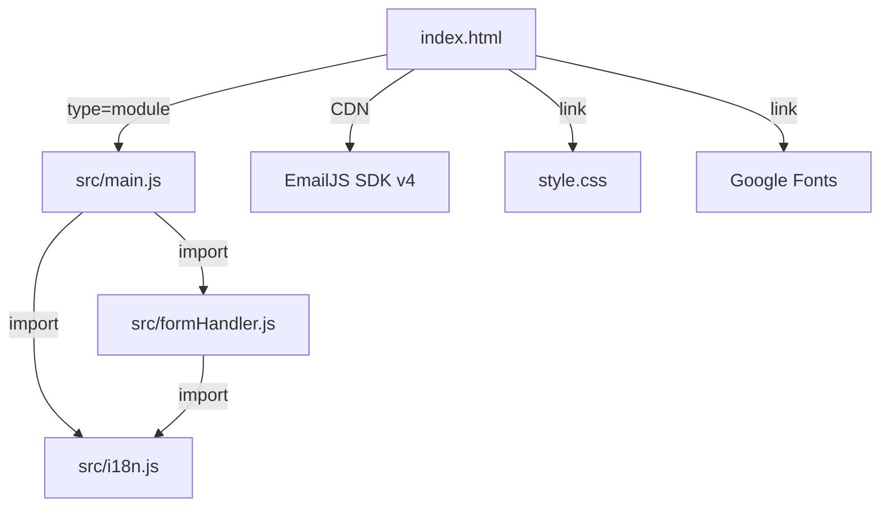

<p align="center">
  <strong style="font-size:2rem;">[JR]</strong>
</p>

<h1 align="center">Jostin Rendón — Personal Portfolio / Portafolio Personal</h1>

<p align="center">
  <em>Web Developer · IT Support · AI Automation Specialist</em><br/>
  <em>Desarrollador Web · Soporte TI · Especialista en Automatización con IA</em>
</p>

<p align="center">
  <a href="https://jr-portfolio-theta.vercel.app/">
    
  </a>
  <a href="https://vercel.com">
    
  </a>
  
  
</p>

---

## 📸 Preview / Vista Previa

<p align="center">
  
</p>

---

## 📖 About the Project / Descripción del Proyecto

**🇺🇸 English**

Professional portfolio of **Jostin Rendón**, Systems Engineering student at the University of Guayaquil (Ecuador). Designed to showcase real projects, professional experience, technical skills, and verified certifications.

Built **entirely from scratch** — no UI frameworks, no templates, no Bootstrap — using only HTML5, CSS3, and vanilla JavaScript. Prioritizes performance, accessibility, modern design, and a seamless user experience across all devices.

**🇪🇨 Español**

Portafolio profesional de **Jostin Rendón**, estudiante de Ingeniería en Sistemas en la Universidad de Guayaquil (Ecuador). Diseñado para presentar proyectos reales, experiencia profesional, habilidades técnicas y certificaciones verificadas.

Construido **completamente desde cero** — sin frameworks de UI, sin plantillas, sin Bootstrap — usando únicamente HTML5, CSS3 y JavaScript vanilla. Prioriza rendimiento, accesibilidad, diseño moderno y una experiencia de usuario fluida en todos los dispositivos.

### 🎯 Goal / Objetivo

> **🇺🇸** Serve as a digital business card for remote work, freelance, and professional collaborations — demonstrating real technical capability through the portfolio's own design and code.
>
> **🇪🇨** Servir como carta de presentación digital para trabajo remoto, freelance y colaboraciones profesionales — demostrando capacidad técnica real a través del propio diseño y código del portafolio.

---

## ✨ Key Features / Características Principales

| Feature / Característica | 🇺🇸 English | 🇪🇨 Español |
|---|---|---|
| 🌍 **Bilingual i18n** | Full EN/ES internationalization system without page reload. Persisted in `localStorage`. | Sistema de internacionalización completo EN/ES sin recarga de página. Persistido en `localStorage`. |
| 📱 **Mobile-First** | Responsive design optimized for mobile, tablet, and desktop with breakpoints at 480px, 600px, 700px, 768px, 900px, 1024px, and 1100px. | Diseño responsivo optimizado para móvil, tablet y escritorio con breakpoints en 480px, 600px, 700px, 768px, 900px, 1024px y 1100px. |
| ✍️ **Typewriter Effect** | Typing animation cycling through professional role phrases, adapting to the active language. | Animación de texto que cicla entre frases de rol profesional, adaptándose al idioma activo. |
| 🖱️ **Custom Cursor** | Dual cursor (dot + follower) with magnetic hover states on interactive elements. Auto-disabled on touch devices. | Cursor dual (punto + seguidor) con estados de hover magnéticos en elementos interactivos. Se desactiva en dispositivos táctiles. |
| 📜 **Scroll Reveal** | Entry animations (up, left, right) triggered by `IntersectionObserver` with configurable stagger delay via CSS `--delay`. | Animaciones de entrada activadas por `IntersectionObserver` con retardo escalonado configurable por CSS `--delay`. |
| 🏷️ **Floating Tags** | Anti-gravity floating tech tags in the hero section. | Etiquetas de tecnología con animación flotante en la sección hero. |
| ✉️ **Contact Form** | Real-time validation, anti-spam honeypot, input sanitization, and automatic email sending via **EmailJS**. | Validación en tiempo real, honeypot anti-spam, sanitización de inputs y envío automático de emails vía **EmailJS**. |
| 🔒 **Security Headers** | CSP, HSTS, X-Frame-Options, X-Content-Type-Options, Referrer-Policy, and Permissions-Policy configured in `vercel.json`. | CSP, HSTS, X-Frame-Options, X-Content-Type-Options, Referrer-Policy y Permissions-Policy configurados en `vercel.json`. |
| 🎨 **Page Loader** | Entry animation with progress bar and staggered hero reveal. | Animación de entrada con barra de progreso y revelación escalonada del hero. |
| ⬆️ **Back to Top** | Floating button that appears on scroll with smooth transition. | Botón flotante que aparece al hacer scroll con transición suave. |
| 🍔 **Hamburger Menu** | Mobile navigation overlay with close on Escape, link click, or toggle. | Overlay de navegación móvil con cierre por Escape, clic en enlace o toggle. |
| 📊 **Experience Timeline** | Interactive timeline showing work experience, education, and certifications with visual type indicators. | Línea temporal interactiva con experiencia laboral, educación y certificaciones con indicadores visuales por tipo. |
| 🏅 **Certifications Grid** | Verified credential cards (IBM, Google, Cambridge) with visual status. | Tarjetas de credenciales verificadas (IBM, Google, Cambridge) con estado visual. |

---

## 🛠️ Tech Stack / Stack Tecnológico

### Core

| Technology / Tecnología | Usage / Uso |
|---|---|
| **HTML5** | Semantic & accessible markup (`<section>`, `<nav>`, `<header>`, `<footer>`, `aria-*`) |
| **CSS3** | CSS Variables (Custom Properties), Grid, Flexbox, `clamp()`, `aspect-ratio`, `@keyframes` animations, mobile-first media queries |
| **JavaScript ES6+** | ES6 Modules (`import`/`export`), `IntersectionObserver`, `async`/`await`, DOM API, `localStorage`, `requestAnimationFrame` |

### Services & Tools / Servicios y Herramientas

| Service / Servicio | Purpose / Propósito |
|---|---|
| **[EmailJS](https://www.emailjs.com/)** | Contact form submission without backend — SDK v4 via CDN / Envío de formulario sin backend |
| **[Google Fonts](https://fonts.google.com/)** | Typography / Tipografía: **Syne** (headings / encabezados) + **DM Sans** (body / cuerpo) |
| **[Unsplash](https://unsplash.com/)** | High-resolution images for projects / Imágenes de alta resolución para proyectos |
| **[Vercel](https://vercel.com/)** | Hosting with automatic CI/CD & security headers / Hosting con CI/CD automático y cabeceras de seguridad |

---

## 📁 Project Structure / Estructura del Proyecto

```
📦 port/
├── 📄 index.html              # Full portfolio HTML structure / Estructura HTML completa
├── 📄 style.css                # Global styles (1241 lines) — Mobile-first / Estilos globales
├── 📄 script.js                # Legacy monolithic script (709 lines) / Script monolítico legacy
├── 📂 src/                     # Modular ES6 architecture / Arquitectura modular ES6
│   ├── 📄 main.js              # Orchestrator — imports & initializes all modules / Orquestador
│   ├── 📄 i18n.js              # Internationalization system + typing effect / Sistema i18n
│   └── 📄 formHandler.js       # Validation, sanitization, honeypot & EmailJS / Validación y EmailJS
├── 📄 vercel.json              # HTTP security headers for production / Cabeceras de seguridad
├── 📄 .env.example             # Documented environment variables (EmailJS) / Variables de entorno
├── 📄 Me.png                   # Personal photo for About section / Foto personal
├── 📄 Resume Jostin Rendon.pdf # Downloadable CV / CV descargable
├── 📄 preview.png              # Portfolio screenshot / Captura de pantalla
└── 📄 README.md                # This file / Este archivo
```

### Modular Architecture / Arquitectura Modular (`src/`)

> **🇺🇸** The project was refactored from a monolithic script (`script.js`) to a modular architecture using ES6 modules.
>
> **🇪🇨** El proyecto fue refactorizado de un script monolítico (`script.js`) a una arquitectura modular con ES6 modules.



| Module / Módulo | Responsibility / Responsabilidad |
|---|---|
| **`main.js`** | Entry point. Imports all modules and runs initialization on `DOMContentLoaded`. Orchestrates: Loader, Cursor, Navbar, Mobile Menu, Scroll Reveal, Back to Top, and Smooth Scroll. / Punto de entrada. Importa todos los módulos e inicializa en `DOMContentLoaded`. |
| **`i18n.js`** | Full EN/ES dictionary (~125 keys per language), typing words, `applyLang()`, `switchLang()`, `initLang()`, `initTyping()`, and language state persisted in `localStorage`. / Diccionario completo EN/ES, palabras del typing y estado de idioma persistido. |
| **`formHandler.js`** | EmailJS initialization, field validation, HTML sanitization (`<tag>` stripping), anti-bot honeypot, loading/success/error states, and visual feedback. / Inicialización de EmailJS, validación, sanitización, honeypot anti-bot y feedback visual. |

---

## 🌐 i18n System / Sistema de Internacionalización

> **🇺🇸** The translation system works without external libraries.
>
> **🇪🇨** El sistema de traducción funciona sin librerías externas.

1. **HTML Markup / Marcado HTML**: Translatable elements use `data-i18n` and `data-i18n-placeholder` attributes:
   ```html
   <h2 data-i18n="about.title">More than a student</h2>
   <input data-i18n-placeholder="form.namePh" placeholder="Your full name" />
   ```

2. **JS Dictionary / Diccionario JS**: `i18n` object with `en` and `es` keys, each containing ~125 translations / traducciones.

3. **Application / Aplicación**: `applyLang()` traverses the DOM and updates `innerHTML` / `placeholder` without reload / sin recarga.

4. **Persistence / Persistencia**: Selected language saved to `localStorage` under `jr-lang` key / Idioma guardado en `localStorage`.

5. **Toggle**: Click the `EN / ES` selector in the navbar or mobile menu to switch languages / Clic en el selector para cambiar idioma.

6. **Dynamic Typing / Typing Dinámico**: Typewriter phrases change based on the active language / Las frases cambian según el idioma activo.

---

## 🔒 Security / Seguridad

> **🇺🇸** The `vercel.json` file configures the following HTTP security headers in production.
>
> **🇪🇨** El archivo `vercel.json` configura las siguientes cabeceras de seguridad HTTP en producción.

| Header / Cabecera | Value / Valor | Purpose / Propósito |
|---|---|---|
| `Content-Security-Policy` | `default-src 'self'; script-src 'self' https://cdn.jsdelivr.net; ...` | Prevents XSS & unauthorized resource loading / Previene XSS y carga de recursos no autorizados |
| `Strict-Transport-Security` | `max-age=63072000; includeSubDomains; preload` | Forces HTTPS for 2 years / Fuerza HTTPS por 2 años |
| `X-Frame-Options` | `DENY` | Prevents clickjacking (iframe embedding) / Previene clickjacking |
| `X-Content-Type-Options` | `nosniff` | Prevents MIME-type sniffing / Previene MIME-type sniffing |
| `Referrer-Policy` | `strict-origin-when-cross-origin` | Controls referrer information in requests / Controla información de referencia |
| `Permissions-Policy` | `camera=(), microphone=(), geolocation=()` | Disables camera, microphone & geolocation access / Deshabilita acceso a cámara, micrófono y geolocalización |

### Form Protections / Protecciones del Formulario

- 🛡️ **Anti-spam honeypot**: Hidden field (`name="_honey"`) that bots fill and real users don't see. Silently discarded if detected. / Campo oculto que los bots completan. Se descarta silenciosamente.
- 🧹 **Input sanitization / Sanitización**: `sanitize()` function strips HTML tags and trims whitespace before validation. / Elimina tags HTML y recorta espacios.
- ✅ **Regex validation / Validación**: Regular expression for email format validation. / Expresión regular para validar formato de email.

---

## 🎨 Design System / Sistema de Diseño

### Color Palette / Paleta de Colores

| CSS Token | Color | Usage / Uso |
|---|---|---|
| `--bg` | `#0A0A0A` | Primary background / Fondo principal |
| `--bg-2` | `#111111` | Alternate section background / Fondo de secciones alternas |
| `--bg-3` | `#171717` | Card background / Fondo de tarjetas |
| `--surface` | `#1C1C1E` | Input & chip surfaces / Superficies de inputs y chips |
| `--accent` | `#007AFF` | Accent color (Electric Blue) / Color de acento |
| `--white` | `#FAFAF8` | Primary text / Texto principal |
| `--gray-2` | `#A8A8A4` | Secondary text / Texto secundario |
| `--gray-3` | `#606060` | Tertiary text & labels / Texto terciario |

### Typography / Tipografía

| Font / Fuente | Usage / Uso | Weights / Pesos |
|---|---|---|
| **Syne** | Headings, logo, titles / Encabezados, logo, títulos | 400–800 |
| **DM Sans** | Body, paragraphs, buttons / Cuerpo, párrafos, botones | 300–500 |

### Spacing Scale / Escala de Espaciado

```
--space-xs:  0.5rem  (8px)
--space-sm:  1rem    (16px)
--space-md:  2rem    (32px)
--space-lg:  4rem    (64px)
--space-xl:  8rem    (128px) — reduced to 5rem on mobile / reducido a 5rem en mobile
```

### Animations / Animaciones

| Animation / Animación | Description / Descripción | Duration / Duración |
|---|---|---|
| `loadFill` | Loader progress bar / Barra de progreso | 1.8s |
| `floatDrift` | Hero floating tags / Etiquetas flotantes | 6s (loop) |
| `pulse` | Availability dot pulse / Punto de disponibilidad | 2s (loop) |
| `blink` | Typing cursor / Cursor del typing | 1s (loop) |
| `scrollBob` / `scrollGrow` | Scroll indicator / Indicador de scroll | 2.5s (loop) |
| Scroll Reveal | `reveal-up`, `reveal-left`, `reveal-right` | 0.7s + CSS delay |

---

## 🚀 Deployment / Despliegue

### Production / Producción (Vercel)

> **🇺🇸** The portfolio is automatically deployed on **Vercel**. Every push to the main branch triggers a new build.
>
> **🇪🇨** El portafolio se despliega automáticamente en **Vercel**. Cada push a la rama principal genera un nuevo build.

🔗 **[https://jr-portfolio-theta.vercel.app/](https://jr-portfolio-theta.vercel.app/)**

### Local Development / Desarrollo Local

1. **Clone the repo / Clonar el repositorio:**
   ```bash
   git clone https://github.com/JostinRendonL/portfolio.git
   cd portfolio
   ```

2. **Serve locally / Servir localmente** (required for ES6 modules / necesario por los ES6 modules):
   ```bash
   # Option 1 / Opción 1: Live Server (VS Code Extension)
   # Option 2 / Opción 2: Python
   python -m http.server 8080

   # Option 3 / Opción 3: npx
   npx serve .
   ```

3. **Open in browser / Abrir en el navegador:**
   ```
   http://localhost:8080
   ```

> **Note / Nota:** No `npm install` or build step required — the project is 100% static. / No se requiere `npm install` ni build step — el proyecto es 100% estático.

### EmailJS Setup / Configuración de EmailJS

> **🇺🇸** To make the contact form work, you need to configure your own EmailJS credentials.
>
> **🇪🇨** Para que el formulario funcione, necesitas configurar tus propias credenciales de EmailJS.

1. Create an account at / Crea una cuenta en [emailjs.com](https://www.emailjs.com/)
2. Set up an email service and template / Configura un servicio de email y una plantilla
3. Update the constants in / Actualiza las constantes en `src/formHandler.js`:
   ```javascript
   const EMAILJS_PUBLIC_KEY  = 'your_public_key';
   const EMAILJS_SERVICE_ID  = 'your_service_id';
   const EMAILJS_TEMPLATE_ID = 'your_template_id';
   ```
4. See / Consulta `.env.example` for reference / como referencia.

---

## 📋 Portfolio Sections / Secciones del Portafolio

| # | Section / Sección | HTML ID | Description / Descripción |
|---|---|---|---|
| 1 | **Hero** | `#home` | Name, dynamic role (typing), CTAs, key stats, floating tags / Nombre, rol dinámico, CTAs, estadísticas y etiquetas flotantes |
| 2 | **About** | `#about` | Photo, professional bio, skill chips, CV download / Foto, biografía, chips de habilidades y descarga de CV |
| 3 | **Skills** | `#skills` | 6-category grid: Web Dev, IT Support, Cybersecurity, Admin, AI/Automation, Languages / Grid de 6 categorías |
| 4 | **Experience** | `#experience` | Timeline: 3 work experiences, 1 education, 1 certifications block / Timeline con experiencias y certificaciones |
| 5 | **Projects** | `#projects` | 6-project grid: 3 web (live demos), 2 case studies, 1 this portfolio / Grid de 6 proyectos |
| 6 | **Certifications** | — | 7 verified credentials (5 IBM, 1 Google, 1 Cambridge) / 7 certificaciones verificadas |
| 7 | **Contact** | `#contact` | Contact info (Email, WhatsApp, LinkedIn, GitHub) + functional form / Info de contacto + formulario |

---

## 📂 Featured Projects / Proyectos Destacados

| Project / Proyecto | Type / Tipo | Stack | Live Demo |
|---|---|---|---|
| **La Cueva** | Restaurant / Restaurante | HTML5, CSS3, JS, Unsplash | [restaurante-iota-liart.vercel.app](https://restaurante-iota-liart.vercel.app/) |
| **Blade & Co.** | Premium Barbershop / Barbería | HTML5, CSS3, JS, CSS Animations | [bladeco.vercel.app](https://bladeco.vercel.app/) |
| **MAISON** | E-Commerce Fashion | HTML5, CSS3, JS (i18n), Cart System | [nova-beta-navy.vercel.app](https://nova-beta-navy.vercel.app/) |
| **Payroll Migration / Migración de Nómina** | Case Study (HR / RRHH) | IESS/SUT, Excel, Google Sheets | — |
| **30+ Workstations / Estaciones** | Case Study (IT) | Windows, Hardware, Freshdesk | — |
| **This Portfolio / Este Portafolio** | Personal Portfolio | HTML5, CSS Grid, JS, i18n, IntersectionObserver | [jr-portfolio-theta.vercel.app](https://jr-portfolio-theta.vercel.app/) |

---

## 🏅 Certifications / Certificaciones

- 🔵 **IBM** — Computer Networks & Network Security / Redes y Seguridad de Red (Coursera, 2026)
- 🔵 **IBM** — Cybersecurity Tools & Cyberattacks / Herramientas y Ciberataques (Coursera, 2026)
- 🔵 **IBM** — Cybersecurity Essentials / Fundamentos de Ciberseguridad (Coursera, 2026)
- 🔵 **IBM** — OS Overview, Administration & Security / Sistemas Operativos: Admin y Seguridad (Coursera, 2026)
- 🔵 **IBM** — Cybersecurity Careers / Carreras en Ciberseguridad (Coursera, 2026)
- 🟢 **Google** — IT Support Professional / Profesional de Soporte TI (Coursera, 2026)
- 🟣 **Cambridge** — English B2 / Inglés B2

---

## 🤝 Contact / Contacto

| Channel / Canal | Link / Enlace |
|---|---|
| 📧 **Email** | [alejorendon2712@gmail.com](mailto:alejorendon2712@gmail.com) |
| 📱 **WhatsApp** | [+593 986 456 791](https://wa.me/593986456791) |
| 💼 **LinkedIn** | [Jostin Rendón](https://www.linkedin.com/in/jostin-alejandro-rendón-lozano-749803386) |
| 🐙 **GitHub** | [JostinRendonL](https://github.com/JostinRendonL) |

---

## 📄 License / Licencia

© 2026 Jostin Rendón. All rights reserved. / Todos los derechos reservados.

---

<p align="center">
  <em>Designed & coded with intention — no templates, no frameworks.</em><br/>
  <em>Diseñado y codificado con intención — sin plantillas, sin frameworks.</em>
</p>
