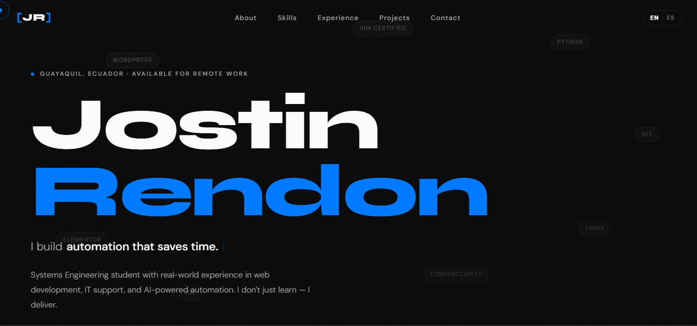
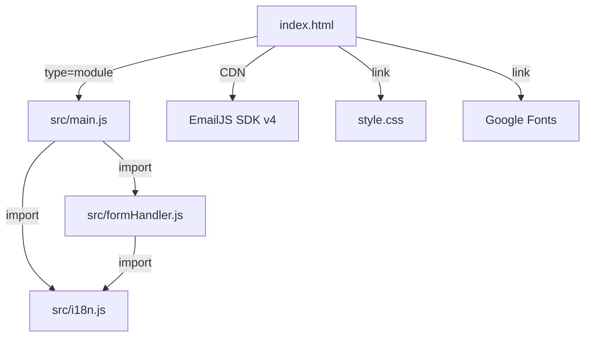

<p align="center">
  <strong style="font-size:2rem;">[JR]</strong>
</p>

<h1 align="center">Jostin Rendón — Portfolio Personal</h1>

<p align="center">
  <em>Desarrollador Web · Soporte TI · Especialista en Automatización con IA</em>
</p>

<p align="center">
  <a href="https://jr-portfolio-theta.vercel.app/">
    
  </a>
  <a href="https://vercel.com">
    
  </a>
  
  
</p>

---

## 📸 Vista Previa

<p align="center">
  
</p>

---

## 📖 Descripción del Proyecto

Portfolio profesional de **Jostin Rendón**, estudiante de Ingeniería en Sistemas en la Universidad de Guayaquil (Ecuador). Diseñado para presentar proyectos reales, experiencia profesional, habilidades técnicas y certificaciones verificadas.

El sitio fue **construido completamente desde cero** — sin frameworks de UI, sin templates, sin Bootstrap — usando únicamente HTML5, CSS3 y JavaScript vanilla. Prioriza rendimiento, accesibilidad, diseño moderno y una experiencia de usuario fluida en todos los dispositivos.

### 🎯 Objetivo

Servir como carta de presentación digital para oportunidades de trabajo remoto, freelance y colaboraciones profesionales, demostrando capacidad técnica real a través del propio diseño y código del portafolio.

---

## ✨ Características Principales

| Característica | Descripción |
|---|---|
| 🌍 **i18n Bilingüe** | Sistema de internacionalización completo EN/ES sin recarga de página. Persistido en `localStorage`. |
| 📱 **Mobile-First** | Diseño responsivo optimizado para móvil, tablet y escritorio con breakpoints en 480px, 600px, 700px, 768px, 900px, 1024px y 1100px. |
| ✍️ **Efecto Typewriter** | Animación de texto que cicla entre frases de rol profesional, adaptándose al idioma activo. |
| 🖱️ **Cursor Personalizado** | Cursor dual (punto + seguidor) con estados de hover magnéticos en elementos interactivos. Se desactiva automáticamente en dispositivos táctiles. |
| 📜 **Scroll Reveal** | Animaciones de entrada (up, left, right) activadas por `IntersectionObserver` con retardo escalonado configurable por CSS `--delay`. |
| 🏷️ **Etiquetas Flotantes** | Tags de tecnología con animación antigravitacional flotante en la sección hero. |
| ✉️ **Formulario de Contacto** | Validación en tiempo real, honeypot anti-spam, sanitización de inputs y envío automático de emails vía **EmailJS**. |
| 🔒 **Cabeceras de Seguridad** | CSP, HSTS, X-Frame-Options, X-Content-Type-Options, Referrer-Policy y Permissions-Policy configurados en `vercel.json`. |
| 🎨 **Cargador de Página** | Animación de entrada con barra de progreso y revelación escalonada del hero. |
| ⬆️ **Back to Top** | Botón flotante que aparece al hacer scroll, con transición suave. |
| 🍔 **Menú Hamburguesa** | Overlay de navegación en dispositivos móviles con cierre por Escape, clic en enlace o toggle. |
| 📊 **Timeline de Experiencia** | Línea temporal interactiva que muestra experiencia laboral, educación y certificaciones con indicadores visuales por tipo. |
| 🏅 **Grid de Certificaciones** | Tarjetas de credenciales verificadas (IBM, Google, Cambridge) con estado visual. |

---

## 🛠️ Stack Tecnológico

### Core

| Tecnología | Uso |
|---|---|
| **HTML5** | Marcado semántico y accesible (`<section>`, `<nav>`, `<header>`, `<footer>`, `aria-*`) |
| **CSS3** | Variables CSS (Custom Properties), Grid, Flexbox, `clamp()`, `aspect-ratio`, animaciones `@keyframes`, media queries mobile-first |
| **JavaScript ES6+** | Módulos ES6 (`import`/`export`), `IntersectionObserver`, `async`/`await`, DOM API, `localStorage`, `requestAnimationFrame` |

### Servicios & Herramientas

| Servicio | Propósito |
|---|---|
| **[EmailJS](https://www.emailjs.com/)** | Envío de formulario de contacto sin backend — SDK v4 vía CDN |
| **[Google Fonts](https://fonts.google.com/)** | Tipografía: **Syne** (encabezados) + **DM Sans** (cuerpo) |
| **[Unsplash](https://unsplash.com/)** | Imágenes de alta resolución para proyectos y hero |
| **[Vercel](https://vercel.com/)** | Hosting con CI/CD automático y cabeceras de seguridad |

---

## 📁 Estructura del Proyecto

```
📦 port/
├── 📄 index.html              # Estructura HTML completa del portafolio
├── 📄 style.css                # Estilos globales (1241 líneas) — Mobile-first
├── 📄 script.js                # Script monolítico legacy (709 líneas)
├── 📂 src/                     # Arquitectura modular ES6
│   ├── 📄 main.js              # Orquestador — importa e inicializa todos los módulos
│   ├── 📄 i18n.js              # Sistema de internacionalización + efecto typing
│   └── 📄 formHandler.js       # Validación, sanitización, honeypot y EmailJS
├── 📄 vercel.json              # Cabeceras de seguridad HTTP para producción
├── 📄 .env.example             # Variables de entorno documentadas (EmailJS)
├── 📄 Me.png                   # Fotografía personal para la sección About
├── 📄 Resume Jostin Rendon.pdf # CV descargable
├── 📄 preview.png              # Captura de pantalla del portafolio
└── 📄 README.md                # Este archivo
```

### Arquitectura Modular (`src/`)

El proyecto fue refactorizado de un script monolítico (`script.js`) a una arquitectura modular con ES6 modules:



| Módulo | Responsabilidad |
|---|---|
| **`main.js`** | Punto de entrada. Importa todos los módulos y ejecuta la inicialización en `DOMContentLoaded`. Orquesta: Loader, Cursor, Navbar, Mobile Menu, Scroll Reveal, Back to Top y Smooth Scroll. |
| **`i18n.js`** | Diccionario completo EN/ES (~125 claves por idioma), typing words, funciones `applyLang()`, `switchLang()`, `initLang()`, `initTyping()` y estado de idioma persistido en `localStorage`. |
| **`formHandler.js`** | Inicialización de EmailJS, validación de campos, sanitización HTML (`<tag>` stripping), honeypot anti-bot, estados de loading/success/error y feedback visual. |

---

## 🌐 Sistema i18n (Internacionalización)

El sistema de traducción funciona sin librerías externas:

1. **Marcado HTML**: Los elementos traducibles usan atributos `data-i18n` y `data-i18n-placeholder`:
   ```html
   <h2 data-i18n="about.title">More than a student</h2>
   <input data-i18n-placeholder="form.namePh" placeholder="Your full name" />
   ```

2. **Diccionario JS**: Objeto `i18n` con claves `en` y `es`, cada una conteniendo ~125 traducciones.

3. **Aplicación**: `applyLang()` recorre el DOM y actualiza `innerHTML` / `placeholder` sin recarga.

4. **Persistencia**: El idioma seleccionado se guarda en `localStorage` bajo la clave `jr-lang`.

5. **Toggle**: Clic en el selector `EN / ES` de la navbar o del menú móvil alterna entre idiomas.

6. **Typing Dinámico**: Las frases del efecto typewriter cambian según el idioma activo.

---

## 🔒 Seguridad

El archivo `vercel.json` configura las siguientes cabeceras de seguridad HTTP en producción:

| Cabecera | Valor | Propósito |
|---|---|---|
| `Content-Security-Policy` | `default-src 'self'; script-src 'self' https://cdn.jsdelivr.net; ...` | Previene XSS, inyección de scripts y carga de recursos no autorizados |
| `Strict-Transport-Security` | `max-age=63072000; includeSubDomains; preload` | Fuerza HTTPS durante 2 años |
| `X-Frame-Options` | `DENY` | Previene clickjacking (iframe embedding) |
| `X-Content-Type-Options` | `nosniff` | Previene MIME-type sniffing |
| `Referrer-Policy` | `strict-origin-when-cross-origin` | Controla información de referencia en peticiones |
| `Permissions-Policy` | `camera=(), microphone=(), geolocation=()` | Deshabilita acceso a cámara, micrófono y geolocalización |

### Protecciones Adicionales en el Formulario

- **Honeypot anti-spam**: Campo oculto (`name="_honey"`) que los bots completan y los usuarios reales no ven. Si se detecta valor, el envío se descarta silenciosamente.
- **Sanitización de inputs**: La función `sanitize()` elimina tags HTML y recorta espacios antes de la validación.
- **Validación con regex**: Expresión regular para validación de formato de email.

---

## 🎨 Sistema de Diseño

### Paleta de Colores

| Token CSS | Color | Uso |
|---|---|---|
| `--bg` | `#0A0A0A` | Fondo principal |
| `--bg-2` | `#111111` | Fondo de secciones alternas |
| `--bg-3` | `#171717` | Fondo de tarjetas |
| `--surface` | `#1C1C1E` | Superficies de inputs y chips |
| `--accent` | `#007AFF` | Color de acento (Electric Blue) |
| `--white` | `#FAFAF8` | Texto principal |
| `--gray-2` | `#A8A8A4` | Texto secundario |
| `--gray-3` | `#606060` | Texto terciario / labels |

### Tipografía

| Fuente | Uso | Pesos |
|---|---|---|
| **Syne** | Encabezados, logo, títulos | 400–800 |
| **DM Sans** | Cuerpo, párrafos, botones | 300–500 |

### Escala de Espaciado

```
--space-xs:  0.5rem  (8px)
--space-sm:  1rem    (16px)
--space-md:  2rem    (32px)
--space-lg:  4rem    (64px)
--space-xl:  8rem    (128px) — reducido a 5rem en mobile
```

### Animaciones

| Animación | Descripción | Duración |
|---|---|---|
| `loadFill` | Barra de progreso del loader | 1.8s |
| `floatDrift` | Etiquetas flotantes del hero | 6s (loop) |
| `pulse` | Punto de disponibilidad pulsante | 2s (loop) |
| `blink` | Cursor de la animación typing | 1s (loop) |
| `scrollBob` / `scrollGrow` | Indicador de scroll | 2.5s (loop) |
| Scroll Reveal | `reveal-up`, `reveal-left`, `reveal-right` | 0.7s con delay CSS |

---

## 🚀 Despliegue

### Producción (Vercel)

El portafolio se despliega automáticamente en **Vercel**. Cada push a la rama principal genera un nuevo build:

🔗 **[https://jr-portfolio-theta.vercel.app/](https://jr-portfolio-theta.vercel.app/)**

### Desarrollo Local

1. **Clonar el repositorio:**
   ```bash
   git clone https://github.com/JostinRendonL/portfolio.git
   cd portfolio
   ```

2. **Servir localmente** (se necesita un servidor local por los ES6 modules):
   ```bash
   # Opción 1: Live Server (VS Code Extension)
   # Opción 2: Python
   python -m http.server 8080

   # Opción 3: npx
   npx serve .
   ```

3. **Abrir en el navegador:**
   ```
   http://localhost:8080
   ```

> **Nota:** No se requiere `npm install` ni build step — el proyecto es 100% estático.

### Configuración de EmailJS

Para que el formulario de contacto funcione, necesitas configurar tus propias credenciales de EmailJS:

1. Crea una cuenta en [emailjs.com](https://www.emailjs.com/)
2. Configura un servicio de email y una plantilla
3. Actualiza las constantes en `src/formHandler.js`:
   ```javascript
   const EMAILJS_PUBLIC_KEY  = 'tu_public_key';
   const EMAILJS_SERVICE_ID  = 'tu_service_id';
   const EMAILJS_TEMPLATE_ID = 'tu_template_id';
   ```
4. Consulta `.env.example` para referencia de las variables.

---

## 📋 Secciones del Portafolio

| # | Sección | ID HTML | Descripción |
|---|---|---|---|
| 1 | **Hero** | `#home` | Nombre, rol dinámico (typing), CTAs, estadísticas clave y etiquetas flotantes |
| 2 | **About** | `#about` | Fotografía, biografía profesional, chips de habilidades y descarga de CV |
| 3 | **Skills** | `#skills` | Grid de 6 categorías: Web Dev, IT Support, Cybersecurity, Admin, AI/Automation, Languages |
| 4 | **Experience** | `#experience` | Timeline con 3 experiencias laborales, 1 educación y 1 bloque de certificaciones |
| 5 | **Projects** | `#projects` | Grid de 6 proyectos: 3 web (live demos), 2 case studies, 1 este portafolio |
| 6 | **Certifications** | — | 7 certificaciones verificadas (5 IBM, 1 Google, 1 Cambridge) |
| 7 | **Contact** | `#contact` | Info de contacto (Email, WhatsApp, LinkedIn, GitHub) + formulario funcional |

---

## 📂 Proyectos Destacados

| Proyecto | Tipo | Stack | Demo |
|---|---|---|---|
| **La Cueva** | Restaurante | HTML5, CSS3, JS, Unsplash | [restaurante-iota-liart.vercel.app](https://restaurante-iota-liart.vercel.app/) |
| **Blade & Co.** | Barbería Premium | HTML5, CSS3, JS, CSS Animations | [bladeco.vercel.app](https://bladeco.vercel.app/) |
| **MAISON** | E-Commerce Fashion | HTML5, CSS3, JS (i18n), Cart System | [nova-beta-navy.vercel.app](https://nova-beta-navy.vercel.app/) |
| **Migración de Nómina** | Case Study (RRHH) | IESS/SUT, Excel, Google Sheets | — |
| **30+ Estaciones** | Case Study (IT) | Windows, Hardware, Freshdesk | — |
| **Este Portafolio** | Portfolio Personal | HTML5, CSS Grid, JS, i18n, IntersectionObserver | [jr-portfolio-theta.vercel.app](https://jr-portfolio-theta.vercel.app/) |

---

## 🏅 Certificaciones

- 🔵 **IBM** — Computer Networks & Network Security (Coursera, 2026)
- 🔵 **IBM** — Cybersecurity Tools & Cyberattacks (Coursera, 2026)
- 🔵 **IBM** — Cybersecurity Essentials (Coursera, 2026)
- 🔵 **IBM** — OS Overview, Administration & Security (Coursera, 2026)
- 🔵 **IBM** — Cybersecurity Careers (Coursera, 2026)
- 🟢 **Google** — IT Support Professional (Coursera, 2026)
- 🟣 **Cambridge** — English B2

---

## 🤝 Contacto

| Canal | Enlace |
|---|---|
| 📧 **Email** | [alejorendon2712@gmail.com](mailto:alejorendon2712@gmail.com) |
| 📱 **WhatsApp** | [+593 986 456 791](https://wa.me/593986456791) |
| 💼 **LinkedIn** | [Jostin Rendón](https://www.linkedin.com/in/jostin-alejandro-rendón-lozano-749803386) |
| 🐙 **GitHub** | [JostinRendonL](https://github.com/JostinRendonL) |

---

## 📄 Licencia

© 2026 Jostin Rendón. Todos los derechos reservados.

---

<p align="center">
  <em>Diseñado y codificado con intención — sin plantillas, sin frameworks.</em>
</p>
